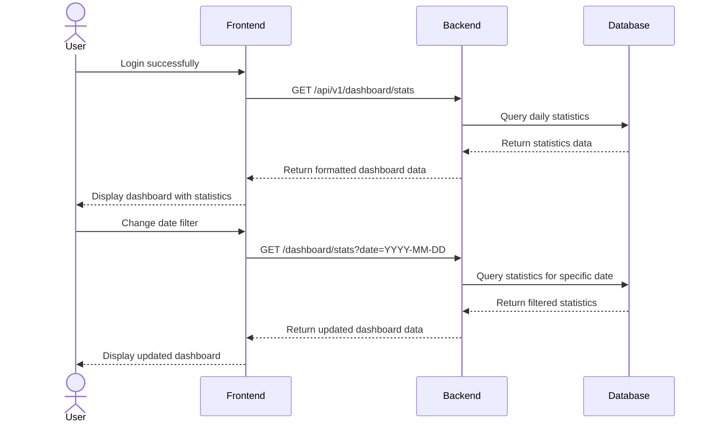
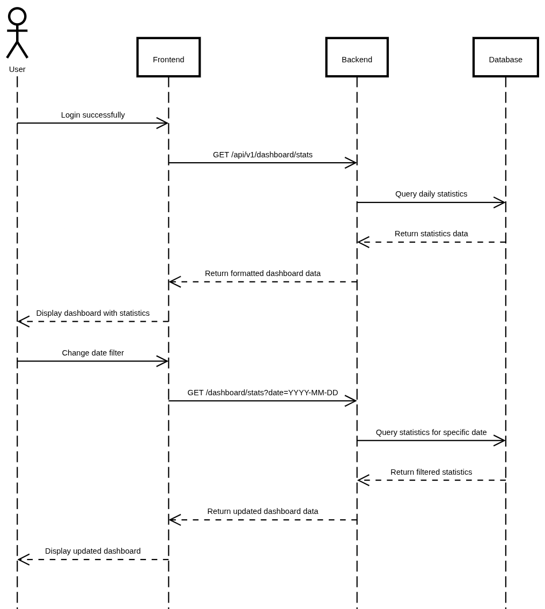

# Dashboard Viewing

## User Flow

1. User logs in successfully
2. System redirects to dashboard based on user role
3. Dashboard displays daily statistics for the selected store:
   - Sales metrics (orders, revenue)
   - Inventory metrics (stock levels)
   - Product metrics (active products)
4. User can filter statistics by date range
5. User can switch between different stores (if they have access to multiple)




## Database Operations

### Get Daily Statistics

```typescript
// Get daily statistics for a store
const getDailyStatistics = async (storeId: string, date: Date) => {
  // Format date to get statistics for specific day
  const startOfDay = new Date(date);
  startOfDay.setHours(0, 0, 0, 0);
  
  const endOfDay = new Date(date);
  endOfDay.setHours(23, 59, 59, 999);
  
  // Get statistics from the database
  const dailyStats = await prisma.statistics_daily.findFirst({
    where: {
      store_id: storeId,
      stat_date: {
        gte: startOfDay,
        lte: endOfDay
      }
    }
  });
  
  // If no statistics exist for the day, return empty statistics
  if (!dailyStats) {
    return {
      orders_count: 0,
      paid_orders_count: 0,
      cancelled_orders_count: 0,
      refunded_orders_count: 0,
      gross_revenue: 0,
      net_revenue: 0,
      units_sold: 0,
      units_returned: 0,
      active_product: 0
    };
  }
  
  return dailyStats;
};
```

### Get Store List for User

```typescript
// Get list of stores the user has access to
const getUserStores = async (userId: string) => {
  // Get stores owned by user
  const ownedStores = await prisma.store.findMany({
    where: {
      ownerId: userId
    }
  });
  
  // Get stores where user is a member
  const memberStores = await prisma.store_member.findMany({
    where: {
      userId
    },
    include: {
      store: true
    }
  });
  
  // Combine and format results
  return {
    ownedStores,
    memberStores: memberStores.map(membership => membership.store)
  };
};
```

### Calculate Current Inventory Status

```typescript
// Get current inventory status summary
const getInventoryStatus = async (storeId: string) => {
  // Get products for the store
  const products = await prisma.product.findMany({
    where: {
      store_id: storeId,
      product_status: 'ACTIVE'
    },
    include: {
      inventories: {
        where: {
          status: 'ACTIVE'
        }
      }
    }
  });
  
  // Calculate totals
  const totalProducts = products.length;
  const totalInventory = products.reduce((sum, product) => {
    return sum + product.inventories.reduce((invSum, inv) => invSum + inv.quantity, 0);
  }, 0);
  
  return {
    totalProducts,
    totalInventory
  };
};
```
