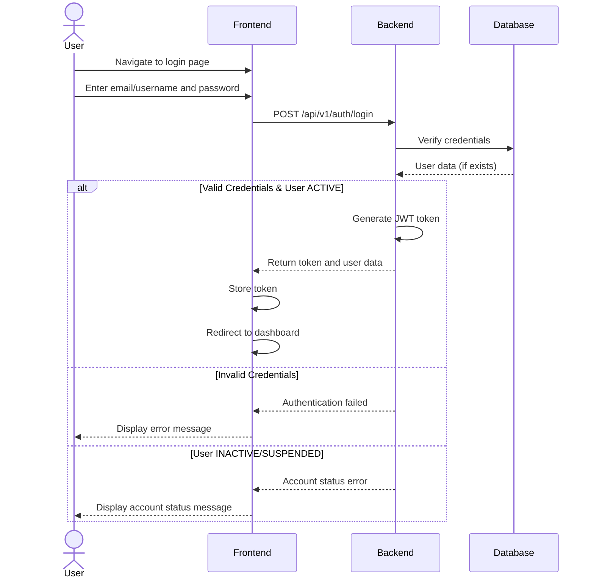
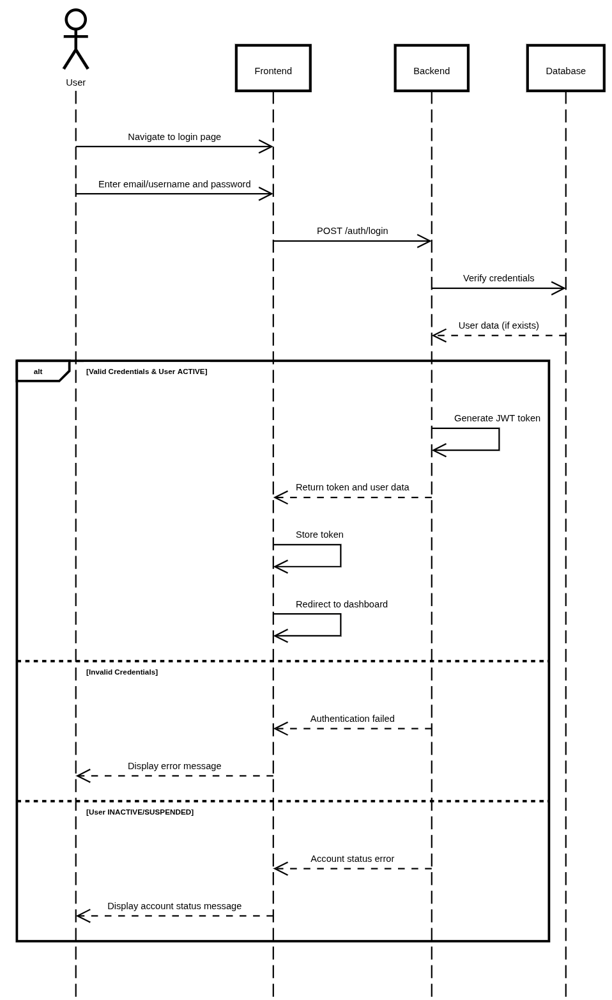

# User Login

## User Flow

1. User navigates to login page
2. User enters email/username and password
3. System validates credentials
4. If credentials are valid:
   - System checks user status (ACTIVE, INACTIVE, SUSPENDED)
   - If ACTIVE, system generates authentication token
   - System redirects user to appropriate dashboard based on role
5. If credentials are invalid, system shows error message





## Database Operations

### Verify User Credentials

```typescript
// Verify user login credentials
const verifyCredentials = async (emailOrUsername: string, password: string) => {
  // Find user by email or username
  const user = await prisma.user.findFirst({
    where: {
      OR: [
        { email: emailOrUsername },
        { username: emailOrUsername }
      ]
    }
  });
  
  if (!user) {
    return null; // User not found
  }
  
  // Check password
  const passwordValid = await bcrypt.compare(password, user.password);
  if (!passwordValid) {
    return null; // Invalid password
  }
  
  // Check user status
  if (user.status !== 'ACTIVE') {
    throw new Error(`Account is ${user.status.toLowerCase()}`);
  }
  
  return user;
};
```

### Get User with Store Information

```typescript
// Get user with their store information (for store owners/members)
const getUserWithStores = async (userId: string) => {
  return await prisma.user.findUnique({
    where: {
      id: userId
    },
    include: {
      ownedStores: true,
      memberships: {
        include: {
          store: true
        }
      }
    }
  });
};
```
