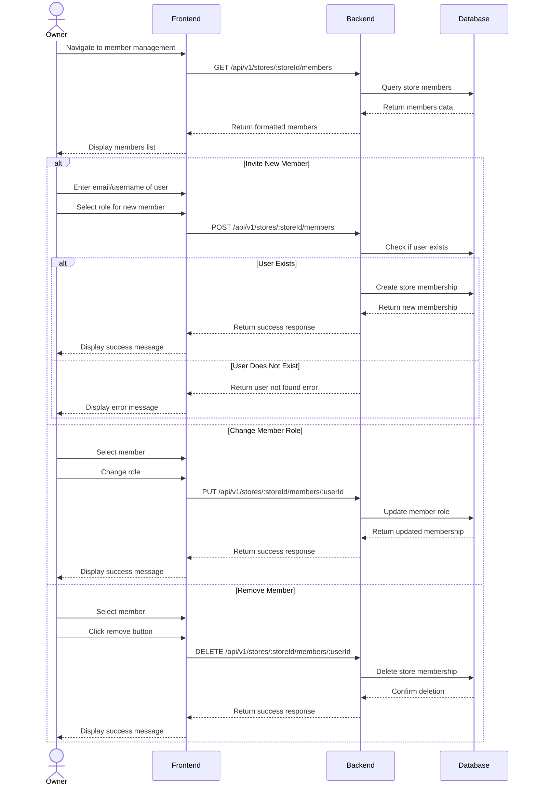

# Member Management

## User Flow

1. Store owner navigates to member management section
2. System displays list of current store members
3. Store owner can:
   - Invite new members
   - Change member roles
   - Remove members from store




## Database Operations

### Get Store Members

```typescript
// Get all members of a store
const getStoreMembers = async (storeId: string) => {
  return await prisma.store_member.findMany({
    where: {
      storeId
    },
    include: {
      user: {
        select: {
          id: true,
          email: true,
          username: true,
          role: true,
          status: true
        }
      }
    }
  });
};
```

### Add Store Member

```typescript
// Add a new member to a store
const addStoreMember = async (
  storeId: string,
  data: {
    userId: string;
    role: 'OWNER' | 'MEMBER';
  }
) => {
  const { userId, role } = data;
  
  // Check if user exists
  const user = await prisma.user.findUnique({
    where: { id: userId }
  });
  
  if (!user) {
    throw new Error('User not found');
  }
  
  // Check if user is already a member
  const existingMembership = await prisma.store_member.findUnique({
    where: {
      storeId_userId: {
        storeId,
        userId
      }
    }
  });
  
  if (existingMembership) {
    throw new Error('User is already a member of this store');
  }
  
  // Create store membership
  return await prisma.store_member.create({
    data: {
      storeId,
      userId,
      role
    },
    include: {
      user: {
        select: {
          id: true,
          email: true,
          username: true,
          role: true,
          status: true
        }
      }
    }
  });
};
```

### Update Member Role

```typescript
// Update a store member's role
const updateMemberRole = async (
  storeId: string,
  userId: string,
  role: 'OWNER' | 'MEMBER'
) => {
  // Check if membership exists
  const existingMembership = await prisma.store_member.findUnique({
    where: {
      storeId_userId: {
        storeId,
        userId
      }
    }
  });
  
  if (!existingMembership) {
    throw new Error('User is not a member of this store');
  }
  
  // Update membership role
  return await prisma.store_member.update({
    where: {
      storeId_userId: {
        storeId,
        userId
      }
    },
    data: {
      role
    },
    include: {
      user: {
        select: {
          id: true,
          email: true,
          username: true,
          role: true,
          status: true
        }
      }
    }
  });
};
```

### Remove Store Member

```typescript
// Remove a member from a store
const removeStoreMember = async (storeId: string, userId: string) => {
  // Check if membership exists
  const existingMembership = await prisma.store_member.findUnique({
    where: {
      storeId_userId: {
        storeId,
        userId
      }
    }
  });
  
  if (!existingMembership) {
    throw new Error('User is not a member of this store');
  }
  
  // Delete membership
  return await prisma.store_member.delete({
    where: {
      storeId_userId: {
        storeId,
        userId
      }
    }
  });
};
```

### Find User by Email or Username

```typescript
// Find a user by email or username
const findUserByEmailOrUsername = async (emailOrUsername: string) => {
  return await prisma.user.findFirst({
    where: {
      OR: [
        { email: emailOrUsername },
        { username: emailOrUsername }
      ]
    },
    select: {
      id: true,
      email: true,
      username: true,
      role: true,
      status: true
    }
  });
};
```

### Transfer Store Ownership

```typescript
// Transfer store ownership to another user
const transferStoreOwnership = async (storeId: string, newOwnerId: string) => {
  // Use transaction to ensure data consistency
  return await prisma.$transaction(async (tx) => {
    // Get store
    const store = await tx.store.findUnique({
      where: { id: storeId }
    });
    
    if (!store) {
      throw new Error('Store not found');
    }
    
    // Check if new owner exists
    const newOwner = await tx.user.findUnique({
      where: { id: newOwnerId }
    });
    
    if (!newOwner) {
      throw new Error('New owner not found');
    }
    
    // Check if new owner is a member
    const membership = await tx.store_member.findUnique({
      where: {
        storeId_userId: {
          storeId,
          userId: newOwnerId
        }
      }
    });
    
    // Update store ownership
    const updatedStore = await tx.store.update({
      where: { id: storeId },
      data: {
        ownerId: newOwnerId
      }
    });
    
    // If new owner was a member, update their role to OWNER
    if (membership) {
      await tx.store_member.update({
        where: {
          storeId_userId: {
            storeId,
            userId: newOwnerId
          }
        },
        data: {
          role: 'OWNER'
        }
      });
    } else {
      // Add new owner as a member with OWNER role
      await tx.store_member.create({
        data: {
          storeId,
          userId: newOwnerId,
          role: 'OWNER'
        }
      });
    }
    
    // Add old owner as a member with MEMBER role
    if (store.ownerId !== newOwnerId) {
      // Check if old owner is already a member
      const oldOwnerMembership = await tx.store_member.findUnique({
        where: {
          storeId_userId: {
            storeId,
            userId: store.ownerId
          }
        }
      });
      
      if (oldOwnerMembership) {
        // Update old owner's role to MEMBER
        await tx.store_member.update({
          where: {
            storeId_userId: {
              storeId,
              userId: store.ownerId
            }
          },
          data: {
            role: 'MEMBER'
          }
        });
      } else {
        // Add old owner as a member with MEMBER role
        await tx.store_member.create({
          data: {
            storeId,
            userId: store.ownerId,
            role: 'MEMBER'
          }
        });
      }
    }
    
    return updatedStore;
  });
};
```
