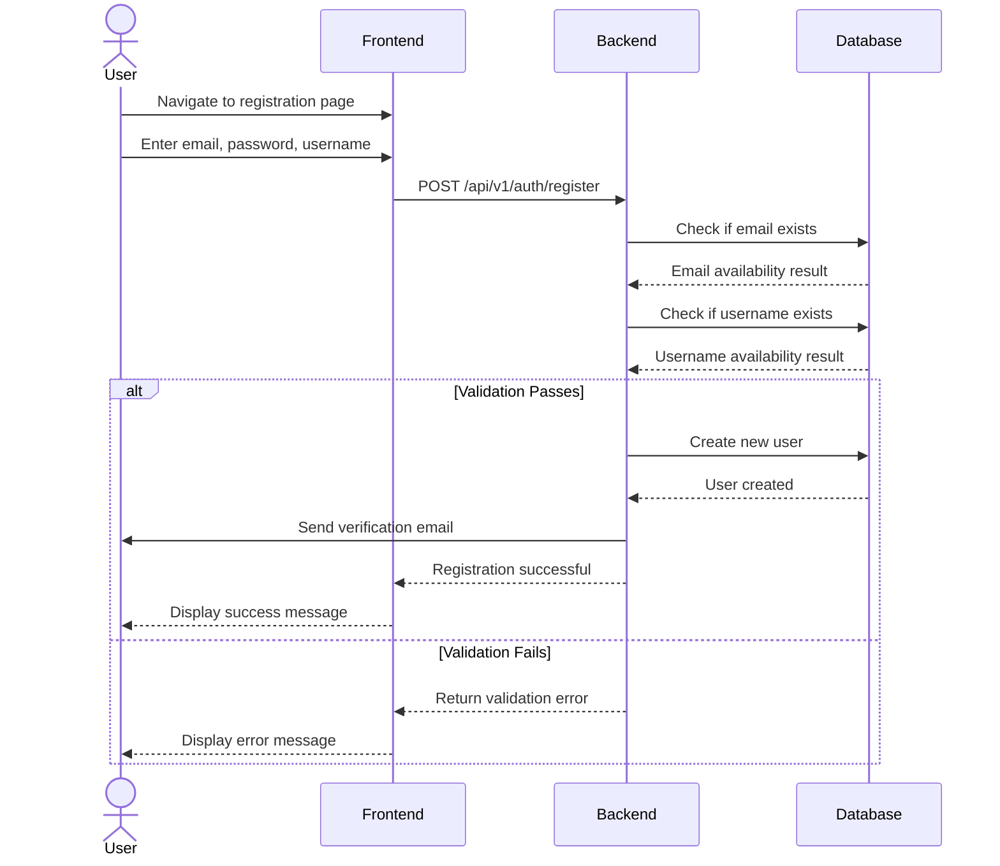
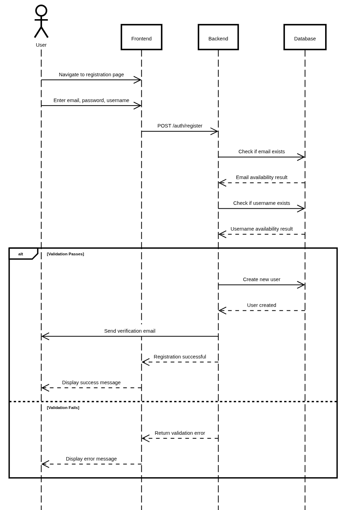

# User Registration

## User Flow

1. User navigates to registration page
2. User enters email, password, and username
3. System validates input:
   - Email must be unique
   - Username must be unique
   - Password must meet security requirements
4. If validation passes, system creates a new user account with default role "USER"
5. System sends verification email to user (optional)
6. User receives confirmation of successful registration





## Database Operations

### Create User

```typescript
// Create a new user in the database
const createUser = async (email: string, password: string, username: string) => {
  const hashedPassword = await bcrypt.hash(password, 10);
  
  return await prisma.user.create({
    data: {
      email,
      password: hashedPassword,
      username,
      role: 'USER',
      status: 'ACTIVE',
      is_verified: false
    }
  });
};
```

### Check Email Availability

```typescript
// Check if email is already in use
const isEmailAvailable = async (email: string) => {
  const existingUser = await prisma.user.findUnique({
    where: {
      email
    }
  });
  
  return !existingUser;
};
```
