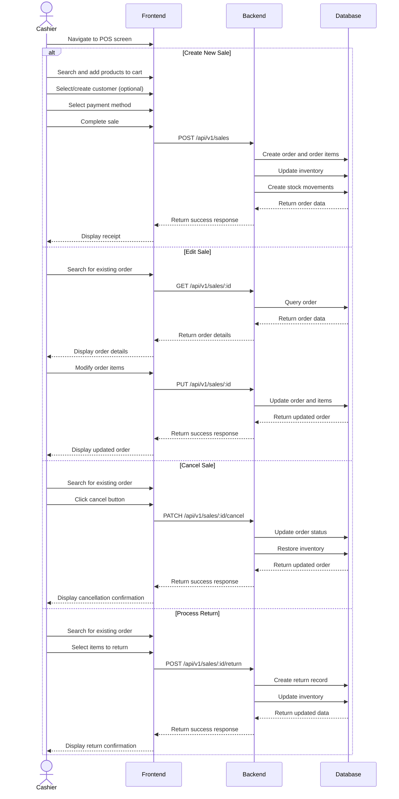
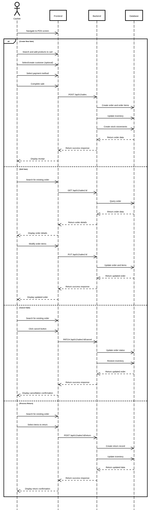

# Sales Management

## User Flow

1. User navigates to sales/POS section
2. System displays sales interface with:
   - Product search
   - Cart management
   - Customer selection/creation
   - Payment processing
3. User can:
   - Create new sales
   - Edit existing sales
   - Cancel sales
   - Process returns
   - View sales history





## Database Operations

### Create Sale

```typescript
// Create a new sale
const createSale = async (
  cashierId: string,
  data: {
    customer_id?: string;
    customer_name?: string;
    items: Array<{
      product_id: string;
      quantity: number;
      price: number;
    }>;
    payment_method: 'CASH' | 'CREDIT_CARD' | 'DEBIT_CARD';
    discount_amount?: number;
    tax_amount?: number;
  }
) => {
  const { customer_id, customer_name, items, payment_method, discount_amount = 0, tax_amount = 0 } = data;
  
  // Calculate subtotal
  const subtotal_amount = items.reduce((sum, item) => sum + (item.price * item.quantity), 0);
  
  // Calculate total
  const total_amount = subtotal_amount - discount_amount + tax_amount;
  
  // Use transaction to ensure data consistency
  return await prisma.$transaction(async (tx) => {
    // Get first product to get store_id
    const firstProduct = await tx.product.findUnique({
      where: { id: items[0].product_id }
    });
    
    if (!firstProduct) {
      throw new Error('Product not found');
    }
    
    // Create order
    const order = await tx.order.create({
      data: {
        code: `ORD-${Date.now()}`,
        product_id: firstProduct.id,
        store_id: firstProduct.store_id,
        cashier_id: cashierId,
        customer_id,
        customer_name,
        subtotal_amount,
        discount_amount,
        tax_amount,
        total_amount,
        payment_method,
        status: 'COMPLETED'
      }
    });
    
    // Create order items and update inventory
    const orderItems = [];
    
    for (const item of items) {
      // Create order item
      const orderItem = await tx.order_item.create({
        data: {
          order_id: order.id,
          product_id: item.product_id,
          quantity: item.quantity,
          price: item.price
        }
      });
      
      orderItems.push(orderItem);
      
      // Update inventory
      const inventory = await tx.inventory.findFirst({
        where: {
          product_id: item.product_id,
          status: 'ACTIVE'
        }
      });
      
      if (inventory) {
        if (inventory.quantity < item.quantity) {
          throw new Error(`Insufficient inventory for product ${item.product_id}`);
        }
        
        await tx.inventory.update({
          where: { id: inventory.id },
          data: { quantity: inventory.quantity - item.quantity }
        });
      } else {
        throw new Error(`No inventory found for product ${item.product_id}`);
      }
      
      // Create stock movement
      await tx.stock_movement.create({
        data: {
          product_id: item.product_id,
          quantity: -item.quantity, // Negative for outgoing stock
          type: 'SALE'
        }
      });
    }
    
    return { order, orderItems };
  });
};
```

### Edit Sale

```typescript
// Edit an existing sale
const editSale = async (
  orderId: string,
  data: {
    customer_id?: string;
    customer_name?: string;
    items: Array<{
      id?: string; // Existing order item ID
      product_id: string;
      quantity: number;
      price: number;
    }>;
    payment_method?: 'CASH' | 'CREDIT_CARD' | 'DEBIT_CARD';
    discount_amount?: number;
    tax_amount?: number;
  }
) => {
  const { customer_id, customer_name, items, payment_method, discount_amount, tax_amount } = data;
  
  // Use transaction to ensure data consistency
  return await prisma.$transaction(async (tx) => {
    // Get existing order
    const existingOrder = await tx.order.findUnique({
      where: { id: orderId },
      include: {
        order_item: true
      }
    });
    
    if (!existingOrder) {
      throw new Error('Order not found');
    }
    
    if (existingOrder.status !== 'PENDING' && existingOrder.status !== 'PROCESSING') {
      throw new Error(`Cannot edit order with status ${existingOrder.status}`);
    }
    
    // Get existing order items
    const existingItems = existingOrder.order_item;
    
    // Calculate new subtotal
    const subtotal_amount = items.reduce((sum, item) => sum + (item.price * item.quantity), 0);
    
    // Calculate new total
    const newDiscountAmount = discount_amount !== undefined ? discount_amount : existingOrder.discount_amount;
    const newTaxAmount = tax_amount !== undefined ? tax_amount : existingOrder.tax_amount;
    const total_amount = subtotal_amount - newDiscountAmount + newTaxAmount;
    
    // Update order
    const updateData: any = {
      subtotal_amount,
      total_amount
    };
    
    if (customer_id !== undefined) updateData.customer_id = customer_id;
    if (customer_name !== undefined) updateData.customer_name = customer_name;
    if (payment_method !== undefined) updateData.payment_method = payment_method;
    if (discount_amount !== undefined) updateData.discount_amount = discount_amount;
    if (tax_amount !== undefined) updateData.tax_amount = tax_amount;
    
    const order = await tx.order.update({
      where: { id: orderId },
      data: updateData
    });
    
    // Handle order items
    
    // 1. Items to delete (in existing but not in new items)
    const newItemIds = items.filter(i => i.id).map(i => i.id as string);
    const itemsToDelete = existingItems.filter(item => !newItemIds.includes(item.id));
    
    for (const item of itemsToDelete) {
      // Restore inventory
      await tx.inventory.updateMany({
        where: {
          product_id: item.product_id,
          status: 'ACTIVE'
        },
        data: {
          quantity: {
            increment: item.quantity
          }
        }
      });
      
      // Create stock movement
      await tx.stock_movement.create({
        data: {
          product_id: item.product_id,
          quantity: item.quantity,
          type: 'ADJUSTMENT'
        }
      });
      
      // Delete order item
      await tx.order_item.delete({
        where: { id: item.id }
      });
    }
    
    // 2. Items to update or create
    for (const item of items) {
      if (item.id) {
        // Update existing item
        const existingItem = existingItems.find(i => i.id === item.id);
        
        if (existingItem) {
          // Calculate quantity difference
          const quantityDiff = item.quantity - existingItem.quantity;
          
          if (quantityDiff !== 0) {
            // Update inventory
            const inventory = await tx.inventory.findFirst({
              where: {
                product_id: item.product_id,
                status: 'ACTIVE'
              }
            });
            
            if (inventory) {
              if (quantityDiff > 0 && inventory.quantity < quantityDiff) {
                throw new Error(`Insufficient inventory for product ${item.product_id}`);
              }
              
              await tx.inventory.update({
                where: { id: inventory.id },
                data: { quantity: inventory.quantity - quantityDiff }
              });
              
              // Create stock movement
              await tx.stock_movement.create({
                data: {
                  product_id: item.product_id,
                  quantity: -quantityDiff,
                  type: 'ADJUSTMENT'
                }
              });
            }
          }
          
          // Update order item
          await tx.order_item.update({
            where: { id: item.id },
            data: {
              quantity: item.quantity,
              price: item.price
            }
          });
        }
      } else {
        // Create new item
        // Update inventory
        const inventory = await tx.inventory.findFirst({
          where: {
            product_id: item.product_id,
            status: 'ACTIVE'
          }
        });
        
        if (inventory) {
          if (inventory.quantity < item.quantity) {
            throw new Error(`Insufficient inventory for product ${item.product_id}`);
          }
          
          await tx.inventory.update({
            where: { id: inventory.id },
            data: { quantity: inventory.quantity - item.quantity }
          });
        } else {
          throw new Error(`No inventory found for product ${item.product_id}`);
        }
        
        // Create stock movement
        await tx.stock_movement.create({
          data: {
            product_id: item.product_id,
            quantity: -item.quantity,
            type: 'SALE'
          }
        });
        
        // Create order item
        await tx.order_item.create({
          data: {
            order_id: orderId,
            product_id: item.product_id,
            quantity: item.quantity,
            price: item.price
          }
        });
      }
    }
    
    return {
      order,
      orderItems: await tx.order_item.findMany({
        where: { order_id: orderId }
      })
    };
  });
};
```

### Cancel Sale

```typescript
// Cancel a sale
const cancelSale = async (orderId: string) => {
  // Use transaction to ensure data consistency
  return await prisma.$transaction(async (tx) => {
    // Get existing order
    const existingOrder = await tx.order.findUnique({
      where: { id: orderId },
      include: {
        order_item: true
      }
    });
    
    if (!existingOrder) {
      throw new Error('Order not found');
    }
    
    if (existingOrder.status === 'CANCELLED') {
      throw new Error('Order is already cancelled');
    }
    
    // Update order status
    const order = await tx.order.update({
      where: { id: orderId },
      data: {
        status: 'CANCELLED'
      }
    });
    
    // Restore inventory for each order item
    for (const item of existingOrder.order_item) {
      // Restore inventory
      await tx.inventory.updateMany({
        where: {
          product_id: item.product_id,
          status: 'ACTIVE'
        },
        data: {
          quantity: {
            increment: item.quantity
          }
        }
      });
      
      // Create stock movement
      await tx.stock_movement.create({
        data: {
          product_id: item.product_id,
          quantity: item.quantity,
          type: 'ADJUSTMENT'
        }
      });
    }
    
    return { order };
  });
};
```

### Process Return

```typescript
// Process a return
const processReturn = async (
  orderId: string,
  data: {
    items: Array<{
      order_item_id: string;
      quantity: number;
    }>;
  }
) => {
  const { items } = data;
  
  // Use transaction to ensure data consistency
  return await prisma.$transaction(async (tx) => {
    // Get existing order
    const existingOrder = await tx.order.findUnique({
      where: { id: orderId },
      include: {
        order_item: true
      }
    });
    
    if (!existingOrder) {
      throw new Error('Order not found');
    }
    
    if (existingOrder.status !== 'COMPLETED') {
      throw new Error(`Cannot process return for order with status ${existingOrder.status}`);
    }
    
    // Process each return item
    for (const item of items) {
      const orderItem = existingOrder.order_item.find(i => i.id === item.order_item_id);
      
      if (!orderItem) {
        throw new Error(`Order item ${item.order_item_id} not found`);
      }
      
      if (item.quantity > orderItem.quantity) {
        throw new Error(`Return quantity exceeds ordered quantity for item ${item.order_item_id}`);
      }
      
      // Restore inventory
      await tx.inventory.updateMany({
        where: {
          product_id: orderItem.product_id,
          status: 'ACTIVE'
        },
        data: {
          quantity: {
            increment: item.quantity
          }
        }
      });
      
      // Create stock movement
      await tx.stock_movement.create({
        data: {
          product_id: orderItem.product_id,
          quantity: item.quantity,
          type: 'RETURN_SALE'
        }
      });
      
      // Update order item quantity
      await tx.order_item.update({
        where: { id: item.order_item_id },
        data: {
          quantity: orderItem.quantity - item.quantity
        }
      });
    }
    
    // Update order status if all items are returned
    const updatedOrderItems = await tx.order_item.findMany({
      where: { order_id: orderId }
    });
    
    const allItemsReturned = updatedOrderItems.every(item => item.quantity === 0);
    
    if (allItemsReturned) {
      await tx.order.update({
        where: { id: orderId },
        data: {
          status: 'RETURNED'
        }
      });
    }
    
    return {
      order: await tx.order.findUnique({
        where: { id: orderId },
        include: {
          order_item: true
        }
      })
    };
  });
};
```
