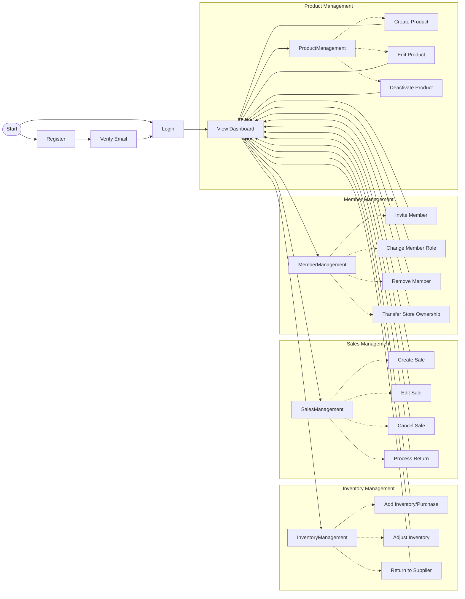
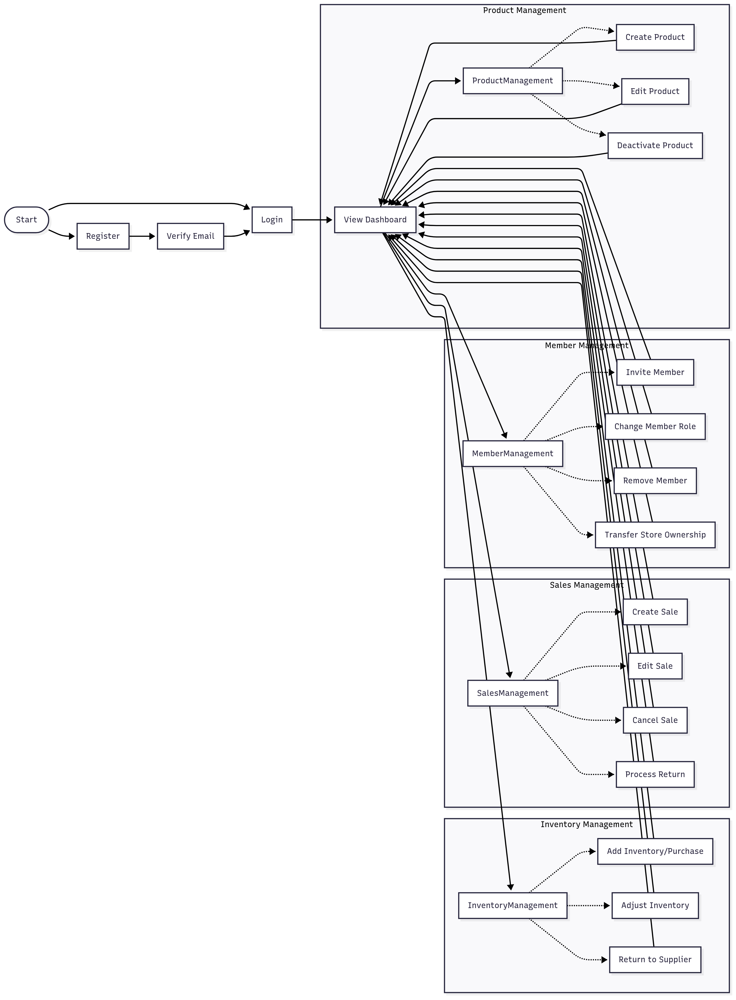

# POS System User Flow

This document provides an overview of the user flow in the POS system and links to detailed use cases.

## Main User Flow Diagram

## User Roles and Permissions

The system has three user roles with different permissions:

1. **ADMIN**
   - Can manage all stores and users
   - Has access to all system features
   - Can create/modify system settings

2. **STAFF**
   - Can manage assigned stores
   - Can perform sales operations
   - Can manage inventory and products
   - Can view reports and statistics

3. **USER**
   - Basic user with limited access
   - Can be assigned to stores as members
   - Permissions depend on store membership role

## Store Membership Roles

Within a store, users can have the following roles:

1. **OWNER**
   - Full control over the store
   - Can manage store members
   - Can manage all store operations

2. **MEMBER**
   - Limited access based on permissions
   - Can perform assigned operations
   - Cannot manage store members

## Detailed Use Cases

For detailed information about each use case, refer to the following documents:

- [User Registration](usecase/registration.md)
- [User Login](usecase/login.md)
- [Dashboard Viewing](usecase/dashboard.md)
- [Product Management](usecase/product-management.md)
- [Inventory Management](usecase/inventory-management.md)
- [Sales Management](usecase/sales-management.md)
- [Member Management](usecase/member-management.md)
